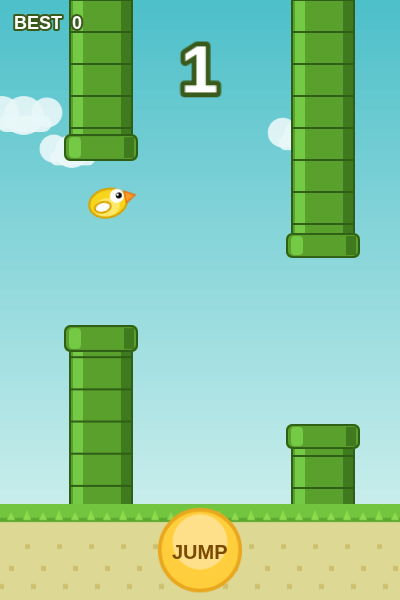

# Flappy Bird — Phaser 3 Clone

A small, self-contained Flappy Bird clone built with [Phaser 3](https://phaser.io/).
Every sprite in the game — the bird, pipes, ground, clouds, sky gradient and the
JUMP button — is **generated at runtime from colored primitives** (Phaser
`Graphics` → `generateTexture`). There are no external image assets.



## Play

No build step and no internet connection required — Phaser is vendored locally.
Just serve the folder over HTTP and open it:

```bash
# any static server works, e.g.:
python3 -m http.server 8000
# then open http://localhost:8000
```

> Opening `index.html` directly via `file://` also works in most browsers.

## Controls

| Action | Input |
| ------ | ----- |
| Flap / jump | **Tap the screen**, click, press **Space** or **↑**, or use the on-screen **JUMP** button |
| Start | Any flap input from the title screen |
| Restart | Tap / Space on the Game Over screen |

The large **JUMP** button pinned to the bottom center is sized for one-handed
phone play — press it to flap.

## Features

- 🐤 **Procedural art** — all textures drawn from primitives at boot, so the
  repo ships no binary image files.
- 📱 **Mobile-friendly** — dedicated on-screen JUMP button plus tap-anywhere
  input; the canvas scales to fit any screen.
- 🏆 **Score & high score** — live score as you clear pipes, with the best
  score persisted to `localStorage` (`flappy-bird-highscore`) across sessions.
- 🎞️ **Juice** — flap animation, bird rotation toward velocity, drifting
  parallax clouds, score pop, screen shake / flash on death.

## Deploying to GitHub Pages

A workflow at `.github/workflows/deploy.yml` builds the site (assembles
`index.html`, `src/`, and the vendored Phaser into a Pages artifact) and
publishes it to GitHub Pages on every push to the game branch or `main`, and on
manual dispatch.

**One-time setup** (the workflow token cannot do this itself): in the repo, go
to **Settings → Pages → Build and deployment** and set **Source** to
**"GitHub Actions"**. The next push (or a manual run from the **Actions** tab)
will deploy, and the live URL appears in the workflow run's `deploy` job and
under Settings → Pages.

> GitHub Pages on a **private** repository requires a paid plan (Pro, Team, or
> Enterprise). On a free plan, make the repository public first.

## Project structure

```
index.html          Page shell + mobile-friendly viewport/styles
src/game.js         All game logic and the procedural texture generation
vendor/phaser.min.js  Phaser 3.80.1 (vendored so the game works offline)
```

## Tuning

Gameplay constants live at the top of `src/game.js` — `FLAP_VELOCITY`,
`GRAVITY`, `PIPE_SPEED`, `PIPE_GAP`, `PIPE_SPACING`, etc. Tweak them to make the
game easier or harder.
