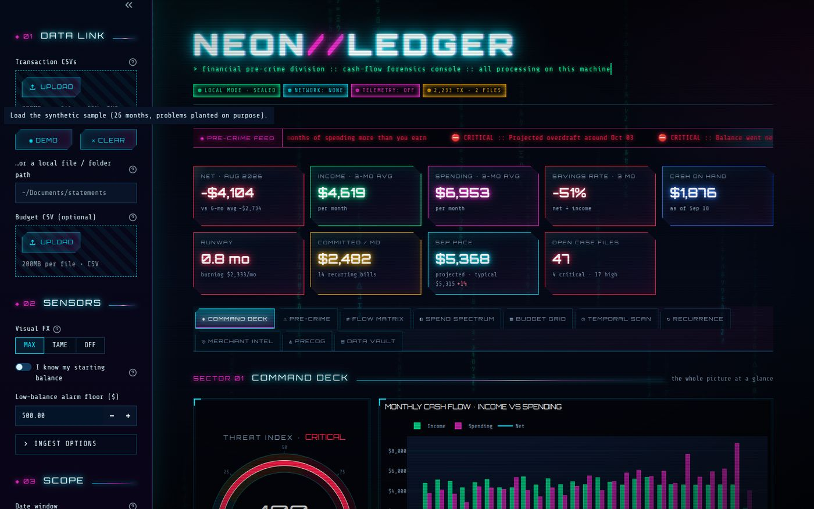
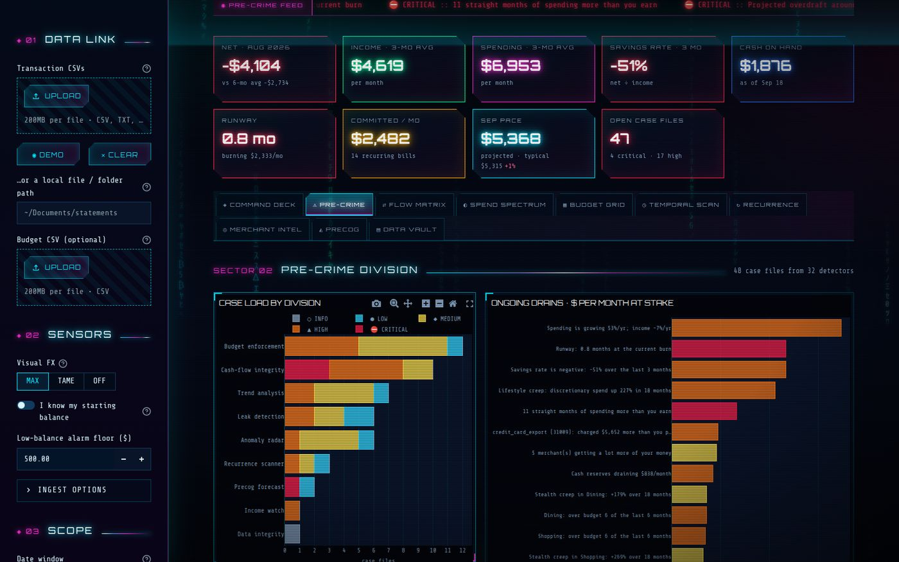
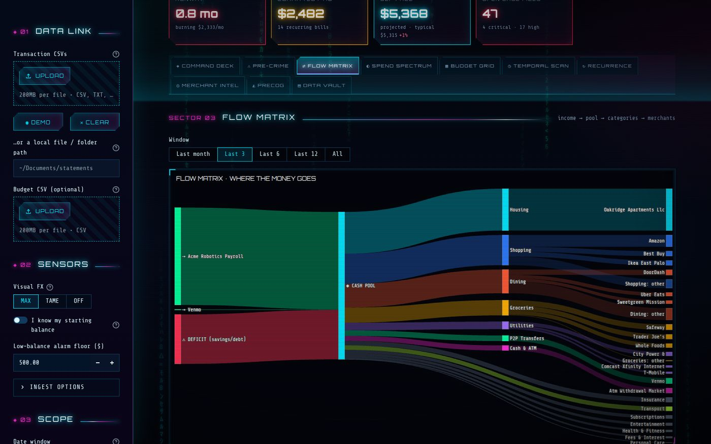
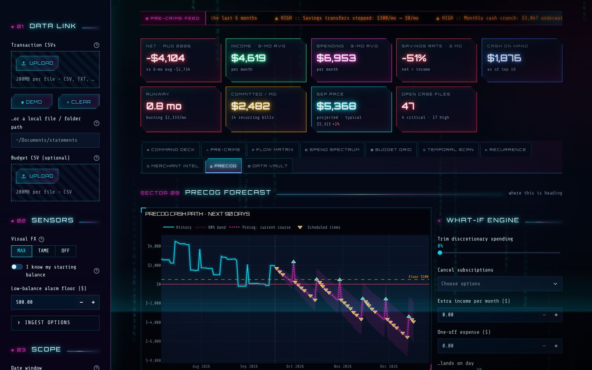
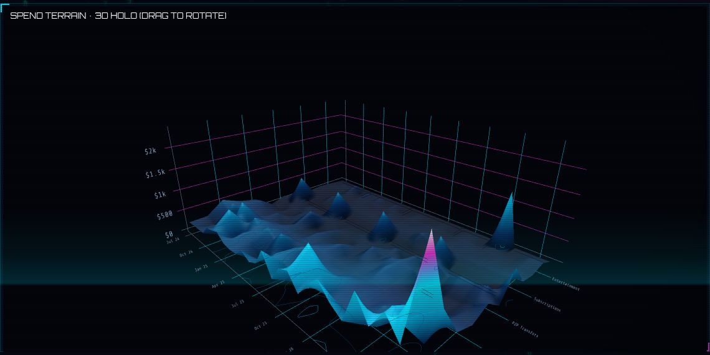

# NEON//LEDGER

**A cash-flow forensics console for your own bank CSVs. It runs only on your
computer and never connects to a bank.**

It turns bank and card exports into about 45 interactive charts and tables, and
runs 32 detectors that look for the cash-flow problems that are hard to spot
from inside a normal month: slow creep, price hikes, timing gaps, a savings
habit that quietly stopped. The interface is deliberately over the top. It
borrows from Minority Report, The Matrix and 2000s sci-fi: code rain, glitch
type, scanlines, holographic panels and a 3D spend terrain. The charts still
have real axes, legends, tooltips and plain-English readouts.



---

## Quick start

```bash
cd experiments/neon-ledger
./run.sh            # macOS / Linux  (Windows: run.bat)
```

The first run builds a private `.venv` and installs four packages: Streamlit,
pandas, NumPy and Plotly. Your browser then opens <http://localhost:8501>.
Click **◉ DEMO** to load the synthetic sample, or drop your own CSVs into
**DATA LINK**.

If you'd rather manage the environment yourself:

```bash
python3 -m venv .venv && source .venv/bin/activate
pip install -r requirements.txt
streamlit run app.py
```

Python 3.10+ is required. Tests: `python -m pytest`.

---

## Local only, and how to check

| Guarantee | How it's enforced | How to verify |
|---|---|---|
| No bank connection | There is no bank API code, no credentials and no Plaid. Input is CSV only. | `grep -rnE "^\s*(import\|from) (requests\|urllib\|http\|socket\|httpx\|aiohttp)" --include=*.py .` finds no networking imports. |
| No one else can reach it | `server.address = "127.0.0.1"` in `.streamlit/config.toml`, and repeated on the command line in `run.sh`/`run.bat`. | `lsof -iTCP -sTCP:LISTEN \| grep 8501` shows `127.0.0.1:8501` only. |
| No telemetry | `browser.gatherUsageStats = false` (also in the launchers). | Watch your browser's Network tab: every request goes to `localhost`. |
| No CDNs or web fonts | The Orbitron and Share Tech Mono fonts (OFL) are vendored in `static/fonts/` and served by Streamlit itself. Plotly comes bundled inside Streamlit. | Same Network tab check. The app also works with Wi-Fi off. |
| No cloud "Deploy" button | `client.toolbarMode = "minimal"`. | |
| You can tell if it's *not* sealed | Current Streamlit reads the `.streamlit/config.toml` next to `app.py` wherever you launch from, but older versions, environment variables or CLI flags can override it. The app checks its own live settings at startup. | Try `streamlit run app.py --server.address 0.0.0.0`: the header chip turns red (UNSEALED) and a warning banner appears. |
| Your data stays out of git | `user_data/` (saved budgets and rules) is gitignored. Uploaded CSVs only live in memory. | |

The only file writes are `user_data/budgets.csv` and `user_data/rules.csv`, and
only when you press a **SAVE** button. Download buttons build their files in the
page.

During development the app was driven headlessly with a request logger on
every tab. It made zero requests to anything but `127.0.0.1`.

---

## Feeding it data

Export CSVs from your bank or card sites and drop in as many as you like
(checking, several cards). Rows that appear in more than one file are
de-duplicated. The ingest engine:

- **sniffs the delimiter** (`,` `;` tab `|`) and **skips preamble lines** such as
  "Account: …" or "Statement period …" above the header
- **auto-maps columns** by name: date, description/payee/merchant, amount *or*
  debit + credit, category, account, running balance, and a DEBIT/CREDIT type column
- **parses messy amounts**: `$1,234.56`, `(12.00)`, `12.00-`, `45.10 CR`, and
  European `1.234,56`
- **detects card exports where purchases are positive** (Amex style) and flips
  them. You can override this per file.
- **cleans merchant names**: `SQ *BLUE BOTTLE COFFEE #12` → `Blue Bottle Coffee`,
  and `ZELLE PAYMENT TO OAKRIDGE APARTMENTS` → the payee
- **categorizes** with 23 keyword rule banks when your file has no Category
  column, and keeps your own categories when it does
- **tags transfers** (card payments, moves to savings) so they never count as
  spending. P2P apps (Venmo, Zelle, PayPal) are deliberately *not* treated as
  transfers, because that's real money leaving.
- **nets refunds** against the category they came back to

If a file maps wrongly, **DATA VAULT › Ingest diagnostics** lets you pick every
column by hand and choose which sign means spending. **Category override rules**
(a pattern → a category, with `/regex/` supported) fix anything the built-in
rules get wrong. You can save them to disk.

Shapes that work out of the box:

```
Date,Description,Amount                     # signed
Date,Description,Debit,Credit               # split
Date,Description,Amount,Type                # unsigned + DEBIT/CREDIT
Posting Date,Description,Amount,Balance     # a running balance unlocks cash forecasting
Date,Description,Category,Amount,Account    # your categories are kept
```

**Balances.** If an export has a running balance, that account's balance
becomes the cash line. That's usually checking, and it's the truest measure of
liquid cash, because card purchases reach it when the card is paid. If no file
has a balance, set **"I know my starting balance"** under SENSORS. Without
either, the cash line shows *cumulative net from zero* (direction only), and
the overdraft forecasts stay off rather than guess.

**Budgets** are optional. Supply a CSV with a category column and a monthly
amount, or edit budgets in the BUDGET GRID. With no budget, each category's
median full month becomes its budget, so "overrun" honestly means "more than
you usually spend."

---

## The ten sectors

| Tab | What's in it |
|---|---|
| **◈ Command deck** | Threat gauge, monthly income/spend/net, a cash line with the 90-day forecast overlaid, a month waterfall, top case files |
| **⚠ Pre-crime** | Every finding as a case file with severity, $ impact, a plain-English explanation, a suggested action, and an evidence chart and table. Also case load by division and the biggest ongoing drains. |
| **⇄ Flow matrix** | Sankey (income → cash pool → categories → merchants, with a DEFICIT source when you overspend), net-per-month with a robust trend, cumulative net, the intra-month **crunch window**, weekly net |
| **◐ Spend spectrum** | Category stack, 100% mix shift, a now-vs-before mix radar, a category → merchant sunburst, an anomaly heat grid (each category against its *own* normal), per-category mini charts with trend lines, rank bump chart, an animated cumulative race, and a **3D spend terrain** |
| **▦ Budget grid** | Current-month pace bullets (projected month-end, not just spent so far), an overrun heat grid, per-category actual vs budget, a leaderboard, and a budget editor |
| **◷ Temporal scan** | GitHub-style spend calendar, weekday radar, seasonal radar, a burn-rate chart (rolling averages, ±2σ band, breakout days), weekday × week-of-month heat, ticket-size distribution now vs before, and a **3D chart of every transaction** |
| **↻ Recurrence** | Subscription/bill timeline (magenta = price rose, ◇ = next predicted charge), commitment load over time, price-drift chart, stream registry with sparklines, charges due in the next 45 days, recurring income |
| **◎ Merchant intel** | Pareto ("N merchants = 80% of spend"), a frequency × ticket-size bubble chart, merchant heat, spending at first-time merchants, a merchant table |
| **◭ Precog** | A 90-day day-by-day cash projection with an 80% band and scheduled bills and paychecks marked, plus a **what-if tool** (trim discretionary spending, cancel subscriptions, add income, add a one-off hit) and a 6-month trajectory |
| **▤ Data vault** | Searchable transaction table (text or `/regex/`) with CSV export, category override rules, per-file ingest diagnostics and remapping, and a privacy summary |

Visual FX has three levels under SENSORS: **MAX** (code rain, scan beam, Tron
floor, glitch title), **TAME** (glow, no motion) and **OFF**. The OS
reduced-motion setting turns animation off regardless of the level. The layout
works down to phone width.



---

## The detectors

All 32 live in `neon_ledger/detectors.py`. Each is a small function, and one
failing never takes the others down. Trends use **Theil–Sen slopes with a
Mann–Kendall test** rather than least squares. Real spending is spiky, and one
vacation shouldn't create or hide a trend. **Partial months** (the ragged ends of
every export) are excluded from all trends and baselines; otherwise they'd look
like sudden collapses.

| Division | Detector | Looks for |
|---|---|---|
| Cash-flow | Deficit streak | Consecutive months spending more than you earn |
| | Negative / sliding savings rate | Last 3 months vs the 6 before |
| | **Crunch window** | Within an average month, the day bills and spending get ahead of deposits, and the cushion you need to get through it |
| | Low balance / overdrawn | Days under your alarm floor or below zero, from the last 90 |
| | Reserve drain | Month-end balances trending down, and how long the cash lasts |
| | Runway | Months of cash left at the current deficit |
| | **Card debt build-up** | Card charges outrunning payments, i.e. a revolving balance that never shows up as "spending" |
| | Bill cluster | Most fixed bills landing in the same week |
| | Housing / fixed-cost ratio | Rent above ~33% of income; commitments above 60% |
| Trend | Spend outpacing income | Robust growth rates compared, with a projected crossover date |
| | **Lifestyle creep** | Discretionary spending rising steadily while no single month looks bad |
| | **Stealth creep** | The same, per category |
| | Velocity | Last 30 days near the top of every 30-day window on record |
| | Weekend drift | More of your discretionary spending moving to weekends |
| | Merchant surge | Merchants getting 60%+ more than before |
| Budget | Chronic overrun | Over budget in 3+ of the last 6 months (real budgets only; against a median baseline half of all months are "over" by definition) |
| | Already blown / on pace to overrun | Current month, projected additively (rent paid on the 1st doesn't get multiplied) |
| | Budget bigger than income · unbudgeted spending | Problems with the plan itself |
| Recurrence | **Price hikes** | Fixed charges that crept up, including promo expiry (a $4 stream ending and a $25 one starting) |
| | New recurring | Subscriptions started in the last ~3 months, with a 2-charge early warning |
| | Subscription load · quiet subscriptions | Totals vs a year ago; small charges renewing for 6+ months |
| | Upcoming lumps | Annual/semiannual bills due within ~75 days |
| | **Savings stopped** | Automatic transfers to savings or investments that dried up. These are invisible in spending charts because transfers are excluded. |
| Leaks | Fees | Overdraft/NSF, card interest (and whether it's growing), ATM, foreign transaction, late fees |
| | **Death by a thousand cuts** | Purchases under $15: count, monthly total, top offenders |
| | Untraceable outflows | Cash and P2P money whose purpose no chart can see |
| | **Payday effect** | Discretionary spending per day in the 3 days after a deposit vs other days |
| Anomaly | Category spikes | Robust z-score vs 6-month history; known annual bills are subtracted first |
| | Duplicate charges | Same merchant and amount within 3 days |
| | Outliers · new big-ticket merchants | Log-scale outliers per category; large spends at first-time merchants |
| Income | Volatility · drop · **lost source** · late paycheck | Irregular pay, a bad month, a side income that went quiet, an expected deposit that didn't arrive |
| Forecast | Precog overdraft / floor breach / risk band · seasonal | The 90-day cash projection crossing zero or your floor; months that historically run hot |
| Data | Uncategorized share · gaps · partial months | Problems in the data itself |

The **threat index** (0–100) adds up the open findings, weighted 22 per
critical, 11 per high, 5 per medium and 2 per low. The test suite includes a
deliberately boring, healthy dataset, which scores 2 (NOMINAL): one low-severity
note and nothing high or critical. The demo persona scores 100.



---

## The demo dataset

`sample_data/` holds 26 months of synthetic transactions for one person across
two files with different formats. A checking export with a preamble, a running
balance and signed amounts; and an Amex-style card export where purchases are
positive. Neither has a category column. Problems were planted on purpose (see
the docstring in `neon_ledger/sample_data.py`), and `tests/test_detectors.py`
checks that each one is found. Regenerate it with
`python -m neon_ledger.sample_data`.



---

## Layout

```
app.py                     Streamlit UI: sidebar, KPI HUD, ten tabs (lazy-rendered)
neon_ledger/ingest.py      sniff / map / parse / normalise CSVs, de-duplicate, budget files
neon_ledger/categorize.py  merchant clean-up, 23 rule banks, transfer/income/refund tagging, user rules
neon_ledger/analytics.py   monthly/daily views, recurrence detection, pace, robust trends, forecasts
neon_ledger/detectors.py   the 32 detectors + threat index
neon_ledger/charts.py      ~45 Plotly figure factories on a custom 'neon' template
neon_ledger/theme.py       palette, page CSS, code rain / scanlines / HUD widgets (pure CSS, no JS)
neon_ledger/pipeline.py    CSV bytes -> analysis, UI-free (python -m neon_ledger.pipeline FILE.csv)
neon_ledger/sample_data.py synthetic demo generator
.streamlit/config.toml     local-only server settings + theme + local font faces
static/fonts/              Orbitron + Share Tech Mono (SIL OFL), served locally
tests/                     pytest suite (ingest formats, categorisation, detectors, healthy-data quiet test)
```

`python -m neon_ledger.pipeline path/to/*.csv` prints the whole report in the
terminal, without starting the UI.

## Known limits

- It categorizes with keyword rules, not machine learning. Unfamiliar merchants
  land in *Uncategorized* (the data-integrity check reports how much) until you
  add an override rule.
- Recurrence needs 3+ charges on a regular cadence (2 for yearly). Streams with
  variable amounts need 5+ before they count.
- The forecast is the current course projected forward (scheduled items plus a
  flat daily burn), not a model of your intentions.
- The 3D charts need WebGL. Any current desktop or mobile browser has it.

The palette's category order was checked with a colour-vision-deficiency
validator. Colour-blind separation between neighbouring colours clears ΔE 23+.
The neon brightness intentionally breaks the usual lightness limits.


